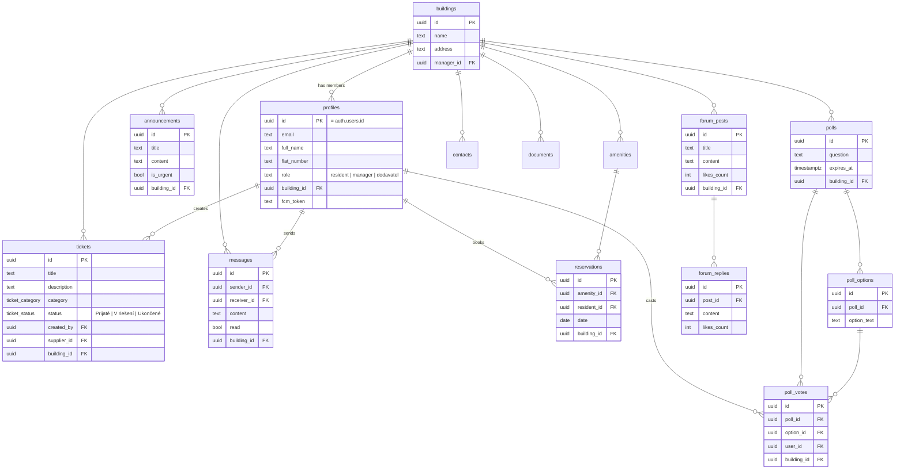

# Architecture

This document explains how Domovník is put together: how the code is organised, how data flows from the database to the screen, how routing adapts to a user's role, what the database looks like, and how push notifications work.

For a high-level product overview see the [README](README.md).

## Table of contents

- [Feature-first structure](#feature-first-structure)
- [Data flow (repository → provider → screen)](#data-flow-repository--provider--screen)
- [Role-based routing](#role-based-routing)
- [Database schema](#database-schema)
- [Row-Level Security](#row-level-security)
- [Push notifications](#push-notifications)

## Feature-first structure

Code is organised by **feature**, not by technical layer. Each feature under `lib/features/<feature>/` is a self-contained vertical slice:

```
lib/features/tickets/
├── models/         # immutable data classes: fromJson / toJson / copyWith,
│                   # plus enums with a Slovak `.label`
├── data/           # repository classes that wrap Supabase calls
└── presentation/
    ├── providers/  # Riverpod providers (state + mutations)
    └── screens/    # Flutter widgets
```

Cross-cutting code lives outside the features:

| Location | Contents |
|---|---|
| `lib/core/` | theme, color constants, Supabase table/column constants, services (notifications, sound), utils (validators, date formatting) |
| `lib/shared/` | widgets reused across features (app bar, status badge, loading/error/empty states) |
| `lib/router/` | the GoRouter configuration and the three navigation shells |
| `lib/app.dart` | `MaterialApp.router` + the auth-state listener |
| `lib/main.dart` | bootstrap: load `.env`, initialise Supabase, Firebase, and FCM |

The payoff: a feature can be read, changed, or removed in isolation, and the layout stays flat as the app grows past 20 features.

## Data flow (repository → provider → screen)

State management is **Riverpod**, and data moves through three layers.

```
Supabase ──▶ Repository ──▶ Provider ──▶ Screen (ConsumerWidget)
   ▲          (data/)        (providers/)     (screens/)
   │                                              │
   └──────────────── mutations ◀──────────────────┘
```

**1. Repository** — wraps `SupabaseClient`. Reads typically return a realtime stream; writes are plain async calls.

```dart
// tickets/data/ticket_repository.dart
Stream<List<TicketModel>> getTickets(String buildingId) =>
    _client.from('tickets')
        .stream(primaryKey: ['id'])
        .eq('building_id', buildingId)
        .map((rows) => rows.map(TicketModel.fromJson).toList());
```

**2. Provider** — exposes repository data to the UI and composes it with other state.

- **Read-only realtime data** uses `StreamProvider` (often `.family`, keyed by `buildingId`). Because it sits on a Supabase `.stream()`, the UI updates live when rows change.
- **Derived state** uses a plain `Provider` — e.g. `filteredTicketsProvider` watches the ticket stream and the selected filter and returns the filtered list.
- **Mutations** (create/update/delete) use `AsyncNotifierProvider`.
- **Root state** is `profileProvider` (an `AsyncNotifier<ProfileModel?>`) — the authoritative source of the user's role and building, used for routing and permission checks everywhere.

```dart
final ticketsProvider = StreamProvider<List<TicketModel>>((ref) async* {
  final profile = await ref.watch(profileProvider.future);
  if (profile == null) return;
  final buildingId = await ref.watch(buildingIdProvider.future);
  yield* ref.read(ticketRepositoryProvider).getTickets(buildingId);
});
```

**3. Screen** — a `ConsumerWidget` that `ref.watch`es a provider and renders its `AsyncValue` with `.when(data / loading / error)`. User actions call mutation notifiers, which refresh the underlying streams.

A note on the authoritative profile: when a user signs in but has no profile row (the `on_auth_user_created` trigger was delayed by email confirmation, or failed), `ProfileNotifier.build()` self-heals by calling the `handle_user_signup` RPC to create the profile before returning it.

## Role-based routing

Navigation is **GoRouter**, configured in `lib/router/app_router.dart` with **three `ShellRoute`s**, one per audience:

| Shell | Bottom navigation |
|---|---|
| `ResidentShell` | Prehľad · Tikety · Fórum · Správy · Ďalšie |
| `ManagerShell` | Prehľad · Oznamy · Tikety · Správy · Ďalšie |
| `SupplierShell` | Tikety · Profil |

The **redirect guard** is the heart of access control. It watches `profileProvider` and:

1. redirects unauthenticated users to `/login`;
2. routes authenticated users into the shell that matches `profile.role` (`manager` / `resident` / `dodavatel`);
3. keeps a user out of routes that belong to another role.

```
            ┌─────────────────────────┐
  request ──▶│  GoRouter redirect()    │
            │  reads profileProvider  │
            └───────────┬─────────────┘
        unauthenticated │ authenticated
                 ▼      ▼
              /login   role?
                ┌───────┼────────────┐
            manager  resident    dodavatel
                ▼       ▼            ▼
          ManagerShell ResidentShell SupplierShell
```

The "Ďalšie" tab opens a drawer of secondary destinations (announcements, polls, reservations, contacts, documents, inspections, house rules, building plan, feedback, and — for managers — residents, building units, suppliers, forum).

**Responsive shells:** on screens wider than 600px the bottom `NavigationBar` is replaced by a `NavigationRail`, so the same routes serve phone and desktop web.

## Database schema

The backend is **Supabase Postgres**. Every domain table carries a `building_id`, which is both the realtime subscription key and the unit of authorization (see [Row-Level Security](#row-level-security)). `profiles.id` is a 1:1 reference to `auth.users(id)`.



Schema lives in `supabase/migrations/` (numbered, applied in order). `supabase/seed_demo.sql` seeds a demo building for the "Try demo" login.

## Row-Level Security

Because the Flutter client talks to Postgres directly, **RLS is the authorization layer** — there is no API tier to enforce rules. Every table has RLS enabled, and policies are expressed in terms of two `SECURITY DEFINER` helper functions that read the caller's JWT-backed profile:

- `auth_building_id()` — the caller's `building_id`
- `auth_role()` — the caller's role

The patterns that recur across tables:

| Operation | Policy shape |
|---|---|
| **Read** | `building_id = auth_building_id()` — members see only their building's data |
| **Insert** | `auth_role() = 'manager' AND building_id = auth_building_id() AND created_by = auth.uid()` for manager-owned content |
| **Update / Delete** | restricted to managers within their own building |

So a resident physically cannot read or mutate another building's rows, and only managers can post announcements, manage contacts/documents, and so on — enforced next to the data rather than in client code that could be bypassed. Sensitive multi-row operations (e.g. like de-duplication) are wrapped in `SECURITY DEFINER` RPCs.

## Push notifications

Clients never hold privileged credentials. Sending a push goes through the **`send-notification` Supabase Edge Function**, which is the only component with the Firebase service account and the Supabase service-role key.

```
┌────────────┐  POST (user JWT)   ┌──────────────────────────┐
│ Flutter    │ ─────────────────▶ │ Edge Function            │
│ Notification│  {building_id |   │ send-notification        │
│ Service     │   target_user_id, │                          │
│            │   title, body,     │ 1. resolve recipients    │
│            │   route}           │    (by building or user) │
└────────────┘                    │ 2. look up fcm_token(s)  │
                                   │    (service-role key)    │
                                   │ 3. mint Google OAuth JWT │
                                   │ 4. POST to FCM v1 API    │
                                   └───────────┬──────────────┘
                                               ▼
                                   ┌──────────────────────────┐
                                   │ Firebase Cloud Messaging │
                                   └───────────┬──────────────┘
                                               ▼
                                   recipient devices / web push
```

**Sending.** `NotificationService` (client) calls the function with the user's access token and one of two shapes:

- `sendToBuilding(buildingId, …, excludeUserId)` — e.g. a new ticket notifies the whole building except its author;
- `sendToUser(targetUserId, …)` — e.g. a ticket status change notifies its creator; a chat message notifies the recipient.

**Server.** The function authenticates via the service-role key, fetches the recipients' `fcm_token`s from `profiles`, signs a short-lived Google OAuth token from the Firebase service account, and dispatches through the FCM HTTP v1 API.

**Deep linking.** Every notification can carry a `route` in its data payload. On tap, `FcmService` navigates GoRouter to that route — and if the app was launched from a terminated state, the pending route is consumed on the first frame in `app.dart`. So tapping a "status changed" push opens that ticket; tapping a chat push opens that conversation.

**Tokens.** Each device registers its FCM token to the user's profile on sign-in (and on app start), so `sendToUser` / `sendToBuilding` always have a current target. FCM initialisation is best-effort — failures are caught and logged so they never crash the app (and Firefox, which lacks FCM web push, degrades gracefully).
